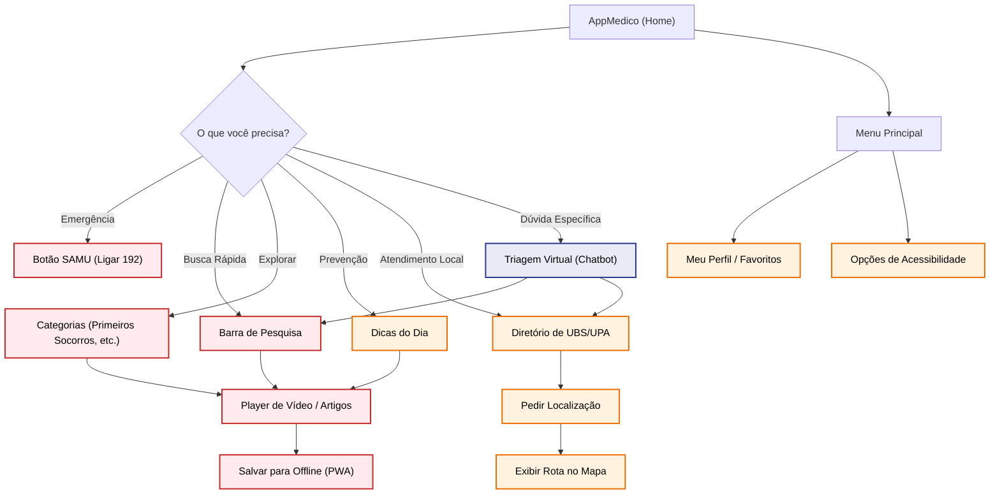

# Fluxograma de Funcionalidades - AppMedico

Abaixo está o fluxo detalhado das funcionalidades do AppMedico, divididas por níveis de prioridade.

```mermaid
graph TD
    A["AppMedico (Home)"] --> B{"O que você precisa?"}
    
    %% MVP Alta Prioridade
    B -->|Emergência| C["Botão SAMU (Ligar 192)"]
    B -->|Busca Rápida| D["Barra de Pesquisa"]
    B -->|Explorar| E["Categorias (Primeiros Socorros, etc.)"]
    
    D --> H["Player de Vídeo / Artigos"]
    E --> H
    H --> H1["Salvar para Offline (PWA)"]
    
    %% Média Prioridade
    B -->|Prevenção| F["Dicas do Dia"]
    F --> H
    B -->|Atendimento Local| G["Diretório de UBS/UPA"]
    G --> G1["Pedir Localização"]
    G1 --> G2["Exibir Rota no Mapa"]
    
    A --> I["Menu Principal"]
    I --> I1["Meu Perfil / Favoritos"]
    I --> I2["Opções de Acessibilidade"]
    
    %% Baixa Prioridade / Futuro
    B -->|Dúvida Específica| J["Triagem Virtual (Chatbot)"]
    J --> D
    J --> G
    
    %% Estilização para as prioridades
    classDef high fill:#ffebee,stroke:#c62828,stroke-width:2px,color:#000
    classDef medium fill:#fff3e0,stroke:#ef6c00,stroke-width:2px,color:#000
    classDef low fill:#e8eaf6,stroke:#283593,stroke-width:2px,color:#000
    
    class C,D,E,H,H1 high
    class F,G,G1,G2,I1,I2 medium
    class J low
```
